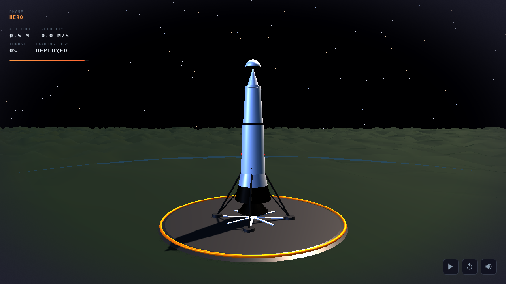
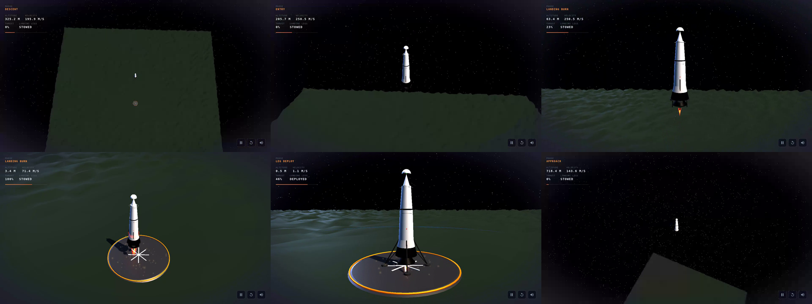

# Rocket Landing 3D — Cinematic 3D Experience

A cinematic JavaScript 3D web experience of a reusable rocket descending from the upper atmosphere and landing vertically on Earth. Built with Vite + TypeScript + Three.js, fully self-contained with no external runtime assets or CDNs.

**Live Demo:** https://jseguillon.github.io/rocket-landing-3d-version2/

### Validated visual demo

[](https://jseguillon.github.io/rocket-landing-3d-version2/)

<video controls width="640">
  <source src="docs/demo.webm" type="video/webm">
  Your browser does not support the video element.
</video>

[Download demo.webm](docs/demo.webm) — VP8 WebM, 1280×720, 42.96 s, 4.05 MB

The contact sheet below shows six decoded phases captured during a single CI run:



Validated in [GitHub Actions run #32245549035](https://github.com/jseguillon/rocket-landing-3d-version2/actions/runs/32245549035). (That run URL serves as provenance reference; it is not guaranteed to remain permanent.)

## Architecture

```
src/
├── main.ts              # Application bootstrap, render loop
├── types.ts             # Shared types, timeline checkpoints, QA API
├── styles.css           # All UI styles (telemetry, controls)
│
├── engine/
│   ├── Scene.ts         # WebGL renderer, camera, resize handling
│   ├── Timeline.ts      # Deterministic timeline state engine (no rendering)
│   ├── Environment.ts   # Starfield, atmosphere, ground, landing pad, lighting
│   ├── Rocket.ts        # Procedural rocket model with legs, fins, lights
│   ├── Camera.ts        # Phase-based camera choreography tracking rocket center
│   ├── Particles.ts     # Engine plume and dust/vapor particle systems
│   └── PostProcessing.ts # Vignette, color grading, film grain shader
│
├── ui/
│   ├── Telemetry.ts     # HUD overlay (phase, altitude, velocity, progress)
│   └── Controls.ts      # Play/pause/replay/mute buttons with keyboard support
│
├── tests/
│   └── Timeline.test.ts # Vitest unit tests for timeline/kinematics
│
e2e/
└── rocket-landing.spec.ts  # Playwright visual + accessibility tests
```

### Key Design Decisions

1. **State separation** — `TimelineEngine` computes all physics/state without Three.js dependencies, enabling deterministic testing and QA query parameters.
2. **Procedural everything** — All geometry, textures, and effects are generated at runtime via code. Zero external assets.
3. **Post-processing shader** — Custom fullscreen quad shader applies cinematic vignette, color grading, and film grain without heavy EffectComposer dependencies.
4. **Mulberry32 RNG** — Seeded pseudo-random number generator ensures deterministic output across runs and browsers.

## Features

- **7-phase descent**: orbital approach → controlled descent → atmospheric entry → landing burn → leg deployment → touchdown → hero shot
- **Procedural rocket model** with deployable landing legs, control fins, navigation/strobe lights, viewport windows, and panel detail lines
- **Particle systems** for engine plume (multi-zone color: white-hot core → yellow-orange → red edge → blue ionization) and ground dust/vapor interaction
- **Camera choreography** with smooth phase transitions — wide establishing shots to close hero angles, always tracking the rocket center
- **Cinematic post-processing** — vignette, warm shadow tint, contrast boost, subtle film grain
- **Real-time telemetry HUD** showing phase, altitude, velocity, thrust percentage, leg status, and progress bar
- **Keyboard controls**: Space/Enter to toggle play/pause, R to replay, M to mute
- **Responsive layout** with mobile-first breakpoints
- **Accessibility**: ARIA roles, labels, focus-visible styles, reduced motion support (static hero shot)
- **DPR clamping** at 2× for performance on high-density displays

## Local Development

```bash
# Install dependencies
npm install

# Start dev server (http://localhost:3000)
npm run dev

# Production build
npm run build

# Preview production build locally
npm run preview
```

### Available Scripts

| Script                         | Description                                                        |
| ------------------------------ | ------------------------------------------------------------------ |
| `npm run dev`                  | Vite development server with HMR                                   |
| `npm run build`                | TypeScript check + Vite production build                           |
| `npm run preview`              | Preview built output locally                                       |
| `npm run lint`                 | ESLint checks                                                      |
| `npm run format:check`         | Prettier formatting check                                          |
| `npm run format:write`         | Prettier auto-format                                               |
| `npm run typecheck`            | TypeScript type checking                                           |
| `npm run test`                 | Vitest unit tests                                                  |
| `npm run test:e2e`             | Playwright end-to-end tests                                        |
| `npm run test:e2e:screenshots` | Run desktop + mobile screenshot capture                            |
| `npm run analyze:screenshots`  | Run pixel analysis on qa-artifacts/screenshots                     |
| `npm run ci:quality`           | Full CI pipeline (install → lint → typecheck → test → build → e2e) |

## Controls

| Input                 | Action                           |
| --------------------- | -------------------------------- |
| **Space / Enter**     | Toggle play/pause animation      |
| **R**                 | Restart animation from beginning |
| **M**                 | Toggle mute                      |
| **Play/Pause button** | Start or pause animation         |
| **Replay button**     | Restart animation                |
| **Mute button**       | Toggle audio mute state          |

## QA Modes

### Deterministic Freeze-Frame Testing

Append query parameters to the URL:

```
/?qa=50&seed=42
```

| Parameter       | Description                                                     |
| --------------- | --------------------------------------------------------------- |
| `qa=<0–100>`    | Freeze animation at that percentage (e.g., `?qa=50` = midpoint) |
| `seed=<number>` | Set procedural randomness seed (default: 42)                    |

**Examples:**

- `/?qa=5&seed=42` — Orbital approach phase
- `/?qa=40&seed=42` — Atmospheric entry
- `/?qa=60&seed=42` — Landing burn ignition
- `/?qa=85&seed=42` — Touchdown

### Window API (for automated testing)

```javascript
// Set exact animation time (seconds)
window.__rocketQA.setState(20); // Freeze at 20 seconds

// Read current time
const currentTime = window.__rocketQA.getTime(); // Returns number or null if not ready

// Jump to a specific phase checkpoint
window.__rocketQA.setCheckpoint('touchdown'); // Jump to touchdown checkpoint

// Play or pause programmatically
window.__rocketQA.play();
window.__rocketQA.pause();

// Check readiness
if (window.__rocketQA.isReady) {
  /* safe to use */
}
```

## Screenshots

Ephemeral CI QA artifacts (screenshots, frame images, contact sheets, and the full video) are uploaded as per-run artifacts in [GitHub Actions](https://github.com/jseguillon/rocket-landing-3d-version2/actions). The representative files under `docs/`—hero.png, demo.webm, and contact-sheet.png—are versioned in this repository and reflect a validated passing run.

## Tech Stack

- **Vite 5** — Build tool and dev server
- **TypeScript 5** — Strict type checking
- **Three.js 0.164** — 3D rendering engine
- **Playwright** — E2E visual testing
- **Vitest** — Unit testing
- **ESLint + Prettier** — Code quality and formatting

## Contributing

See [CONTRIBUTING.md](CONTRIBUTING.md) for development setup, code style guidelines, and the pull request process.

## License

This project is licensed under the [MIT License](LICENSE).

## Security

See [SECURITY.md](SECURITY.md) for reporting security vulnerabilities.
